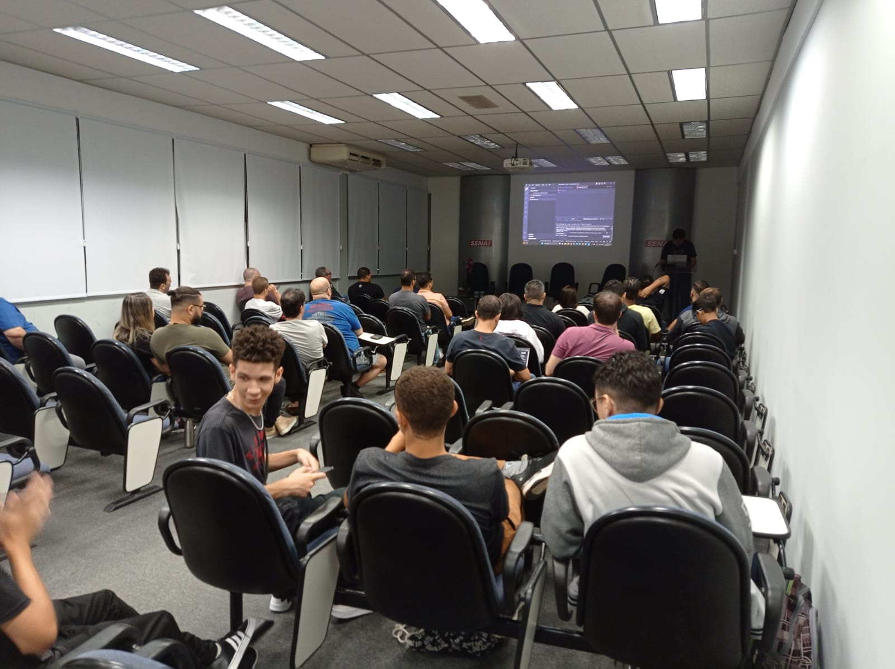

# OpenAI: GitHub Copilot e Chat GPT - .NET São Paulo
Fotos e informações gerais sobre o evento **ChatGPT e GitHub Copilot: produtividade na implementação de código**, realizado em **01/04/2023** na cidade de **São Paulo-SP**.

Organizadores:
- **Renato Groffe (Microsoft MVP, MTAC)**
- **Atila Olivi (SENAI)**
- **Alexandre Vieira (SENAI)**
- **Henrique Eduardo Souza (Microsoft MVP)**

Número de participantes: **41 pessoas**

Apresentações que aconteceram durante o evento:
* **GitHub Copilot: produtividade na implementação de código - Renato Groffe (Microsoft MVP, MTAC)**

* **Utilizando o OpenAI GPT para melhorar a interação com seus usuários - Henrique Eduardo Souza (Microsoft MVP)**

Tecnologias abordadas: **GitHub Copilot, ChatGPT, Azure Cognitive Services, Visual Studio Code, .NET 7, ASP.NET Core, SQL Server, PowerShell, Python, Kubernetes**

Clique [**aqui**](/slides/) para acessar os slides utilizados nas palestras.

Este evento foi uma parceria entre a comunidade [**.NET SP**](https://www.meetup.com/dotnet-Sao-Paulo/) e a [**Escola Senai Suíço-Brasileira Paulo Ernesto Tolle**](https://suicobrasileira.sp.senai.br/).

Formulário utilizado para inscrições: [**Sympla**](https://www.sympla.com.br/evento/chatgpt-e-github-copilot-produtividade-na-implementacao-de-codigo-gratuito-e-presencial/1925171)

Local: Escola SENAI Suíço-Brasileira Paulo Ernesto Tolle - Rua Bento Branco de Andrade Filho, 379 - Santo Amaro - São Paulo/SP - CEP 04757-000

